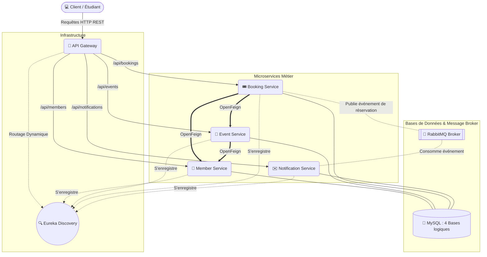

# AlgoTech Hub - Formation Spring Microservices 🚀

Ce projet a été conçu pour le club **AlgoTech** de l'Université de Dschang afin d'enseigner de manière 100% pratique l'architecture orientée Microservices avec **Spring Boot 3** et **Java 21**.

## 🏗️ Architecture du Système

Le système **AlgoTech Hub** modélise la gestion interne du club. Afin de bien illustrer les concepts de ségrégation des données et de tolérance aux pannes, le projet est découpé en plusieurs microservices métier et d'infrastructure.

### Diagramme d'Architecture Synthétique



### 1. Composants d'Infrastructure (Service Mesh)
*   **Discovery Service (Eureka Server)** : L'annuaire du réseau. Aucun microservice métier ne connaît l'adresse IP d'un autre. Ils s'enregistrent tous sur cet annuaire lors de leur démarrage, ce qui permet la résolution des noms (ex: "Trouve-moi le *member-service*").
*   **API Gateway** : La porte d'entrée unique de notre application. Elle redirige intelligemment toutes les requêtes entrantes (`/api/members/**`) vers la bonne instance, allégeant ainsi le client.

### 2. Microservices Métier (Domaines)
*   👔 **Member Service (Port 8081)** : Gère le cycle de vie des membres (Admin, Formateur, Étudiant) et leurs compétences.
*   📅 **Event Service (Port 8082)** : Gère le calendrier et les capacités des événements et des formations du club. *Exemple de flux : Lors de la création d'une formation, il contacte le `member-service` de manière synchrone pour vérifier que le formateur assigné est bien valide.*
*   🎟️ **Booking Service (Port 8083)** : Gère la prise de billet. **C'est le chef d'orchestre complexe :** Il utilise des clients **OpenFeign** pour interroger simultanément le `member-service` (l'étudiant existe-t-il ?) et `event-service` (reste-t-il des places ?).
*   ✉️ **Notification Service (Port 8084)** : Gère l'historique des emails et des alertes envoyées par AlgoTech.

### 3. Le Flux de Communication Asynchrone (RabbitMQ)
Un des objectifs pédagogiques majeurs est d'apprendre la différence entre les communications synchrones (comme vu plushaut avec OpenFeign) et asynchrones.
*   Lorsqu'une réservation est validée en base de données par le `booking-service`, l'étudiant doit recevoir un mail de confirmation. 
*   Au lieu d'attendre que l'email parte (ce qui prend du temps et peut bloquer la requête HTTP), le `booking-service` poste instantanément un message type `NotificationMessage` dans **RabbitMQ**. La requête utilisateur répond immédiatement.
*   De son côté, le `notification-service` écoute passivement la file d'attente, capte le message de confirmation sans pression temporelle, et l'enregistre en base.

---

## 💻 Comment utiliser le projet (Ordre de Lancement)

Le projet utilise des `Profile` Spring. 
*   `dev` : Configuration lorsque les services tournent sur l'IDE natif local (pointe sur `localhost`).
*   `docker` : Configuration pour Docker Compose.

### Option 1 : Tout lancer via Docker Compose (Automatique)
Avez les Dockerfiles en build multi-étapes inclus, vous n'avez pas besoin d'installer Java sur votre PC. Maven et Java sont exécutés dans le conteneur !

```bash
# Construire et démarrer l'ensemble de l'architecture
docker-compose up -d --build

# Voir les logs du système complet
docker-compose logs -f

# Arrêter les services
docker-compose down

# Arrêter les services et supprimer définitivement la base de données
docker-compose down -v
```

### Option 2 : Lancer manuellement pour le développement (Formation avec Maven)

Pendant la formation, les développeurs voudront écrire et tester le code sur leur propre machine en exécutant les dossiers `backend/*` un par un via leur IDE ou la console Maven locale.

**Étape 1 : Démarrer uniquement la Base de Données et RabbitMQ**
```bash
docker-compose up -d mysql-db phpmyadmin rabbitmq
```
*(MySQL est alors mappé sur `localhost:3308` avec ses 4 bases déjà créées, `phpMyAdmin` sur `localhost:8081` et RabbitMQ sur `localhost:15672`)*

**Étape 2 : Démarrer l'infrastructure réseau (L'ordre est important !)**
Il faut que l'annuaire Eureka soit vivant en premier pour que les autres s'y rattachent. Ouvrez plusieurs terminaux distincts :
1.  **Discovery :** `cd backend/discovery-service && ./mvnw spring-boot:run` *(Attendez que le terminal affiche *Started...*)*
2.  **Gateway :** `cd backend/api-gateway && ./mvnw spring-boot:run`

**Étape 3 : Démarrer les services Indépendants**
Ces services n'ont pas d'ordre entre eux car ils se retrouvent via Eureka :
3.  `cd backend/member-service && ./mvnw spring-boot:run`
4.  `cd backend/notification-service && ./mvnw spring-boot:run`

**Étape 4 : Démarrer les services Dépendants**
5.  `cd backend/event-service && ./mvnw spring-boot:run` (A besoin du *member* pour créer un event)
6.  `cd backend/booking-service && ./mvnw spring-boot:run` (A besoin de tout le monde)

---

## 🛠 Tester les API !

Une fois vos services lancés manuellement (via eclipse ou le prompt), vous pouvez facilement tester en passant **toujours** avec l'API Gateway sur le port **8080** :

1.  Créer un membre :
    `POST http://localhost:8080/api/members`
2.  Créer un événement :
    `POST http://localhost:8080/api/events`
3.  Prendre un billet / Effectuer une réservation :
    `POST http://localhost:8080/api/bookings`

Laissez la magie de Spring Cloud s'occuper de router vos éléments ! Bon code à tout le club AlgoTech ! 👨‍💻🎓
